**Project:**

This lab is dedicated to maintain Active Directory, simulating cyber
attacks and monitor them in a SIEM. I'll be using virtual machines for
this lab and I'll be using splunk as the SIEM. I'll use sysmon and
atomic red team as well. Below is diagram:

**VM Installation:**

The first step is to install total of four VM.

1.  Installing a Windows 10 as Client

2.  Installing a Windows server as Active directory domain controller

3.  Installing a ubuntu live server(22.04.x version is preferred) as Splunk server

4.  Installing a Kali linux as Attacker

After installing all the machines need to update and upgrade the ubuntu
and kali machines:

Command : sudo apt-get update && sudo apt-get upgrade.

Now I'm creating a Nat Network profile for this lab and making sure all
the machines are using this network.

**Setup:**

Now lets setup splunk on the ubuntu server. Download the splunk
enterprise free from their website for ubuntu (.deb) . Then install
splunk using dpkg.\
Now change the user to splunk and go to "/opt/splunk/bin" directory and
start splunk. Set username and password for login. Then add splunk in
boot-start.

Now downloaded Universal splunk forwarder and sysmon on both client and
active directory machine.

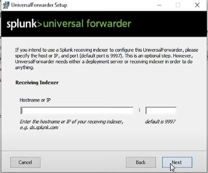{width="3.1770833333333335in"
height="2.278850612423447in"}
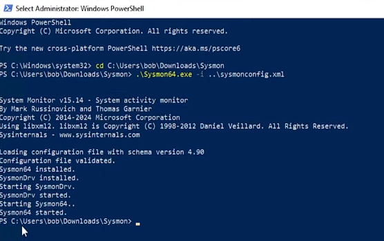{width="3.6919477252843396in"
height="2.1979166666666665in"}

Now create a file named 'inputs.conf' in "C:\\Program
Files\\SplunkUniversalForwarder\\etc\\system\\local\\". Now edit that
file:

> \[WinEventLog://Application\]
>
> index = endpoint
>
> disabled = false
>
> \[WinEventLog://Security\]
>
> index = endpoint
>
> disabled = false
>
> \[WinEventLog://System\]
>
> index = endpoint
>
> disabled = false
>
> \[WinEventLog://Microsoft-Windows-Sysmon/Operational\]
>
> index = endpoint
>
> disabled = false
>
> renderXml = true
>
> source = XmlWinEventLog:Microsoft-Windows-Sysmon/Operational

Splunk will collect log from these sources only. Now from services
restart the SplunkForwarder service to apply this settings. Did this for
both client and active directory machines. Now create a index named
"endpoint" on the splunk server as I have defined this index in the
config file.

Lets check on the splunk that the logs are being generated from this two
machines.

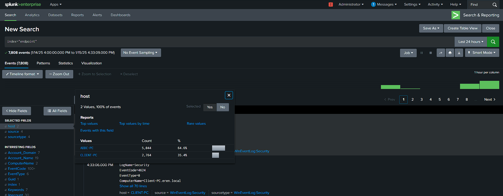{width="7.833333333333333in"
height="2.903986220472441in"}

Lets configure the Active Directory machine now. Firstly open the server
manager.

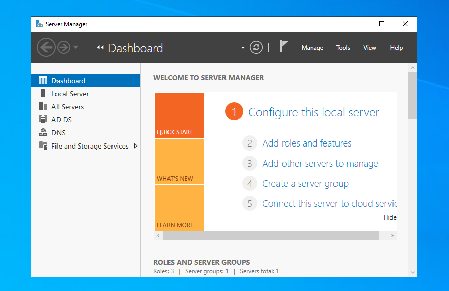{width="4.473958880139983in"
height="2.903219597550306in"}

Then from the manage option selecting "Add roles and Features" and start
setting up.

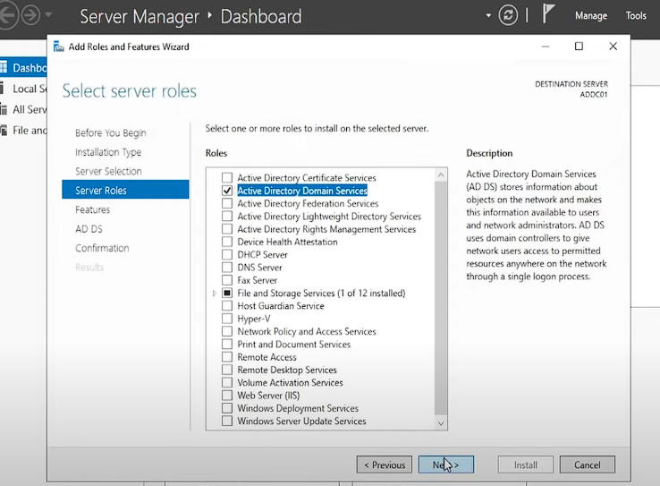{width="4.584421478565179in"
height="2.9721030183727035in"}

Then from the flag option promote this server to domain controller

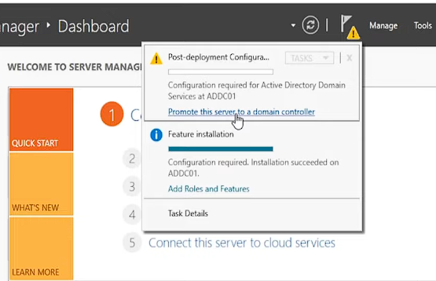{width="4.578125546806649in"
height="2.9530971128608923in"}

Select "add a new forest" from the next window and complete the setup.
The machine will restart and active directory domain controller
installation is done. Now let\'s add some users.

Open the tools section, then open active directory users and computers.
I have created two Organizational Units named HR and IT . Then added one
user in each Unit.

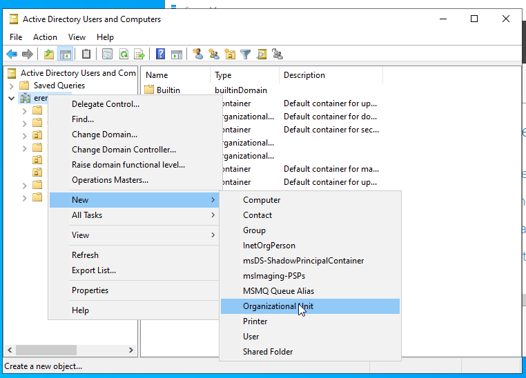{width="5.536458880139983in"
height="3.1770833333333335in"}

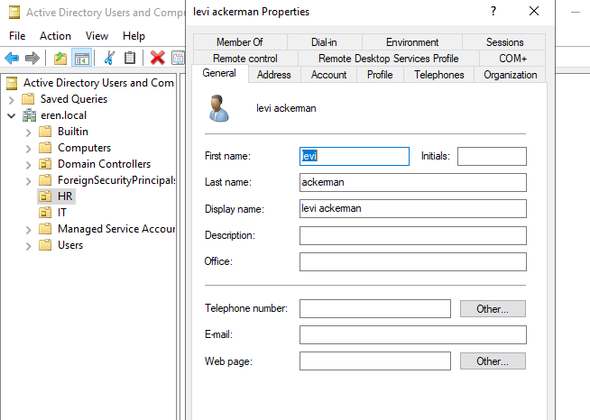{width="3.4418219597550306in"
height="2.4524300087489066in"}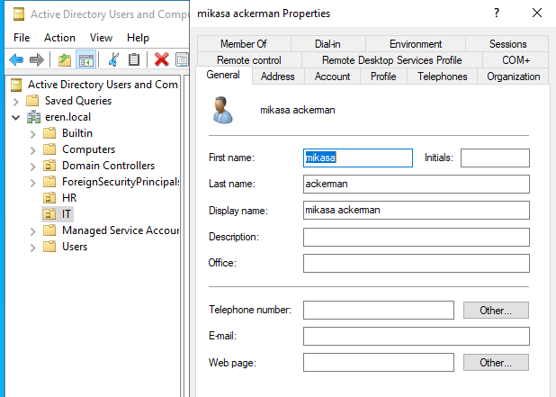{width="3.5632239720034997in"
height="2.5395352143482066in"}

Now for the client machine changed the dns server IP to the Domain
controller machines IP. Added this client machine into the domain from
advance system settings.

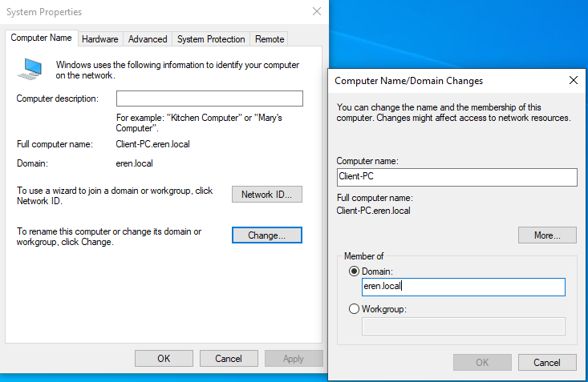{width="6.171875546806649in"
height="3.4270833333333335in"}

After rebooting I logged in using any user credential from that two I
created earlier in Active Directory.

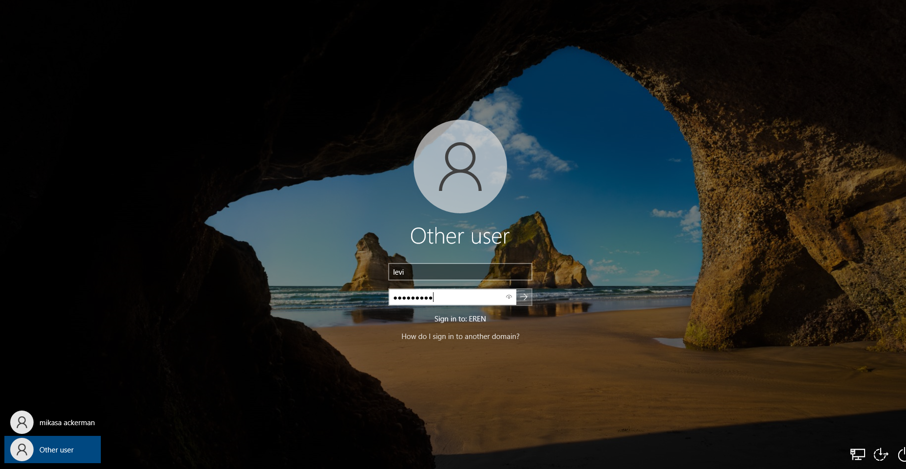{width="6.276042213473316in"
height="3.250764435695538in"}

Now for the attacker machine(Kali) logged in using default credential.
Lets install crowbar.

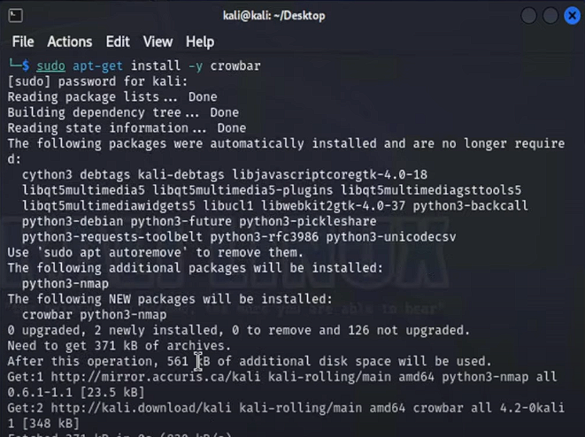{width="4.833333333333333in"
height="2.5848917322834644in"}

Then installed Atomic Red Team using the following command:

IEX (IWR
\'https://raw.githubusercontent.com/redcanaryco/invoke-atomicredteam/master/install-atomicredteam.ps1\'
-UseBasicParsing);

Install-AtomicRedTeam -getAtomics

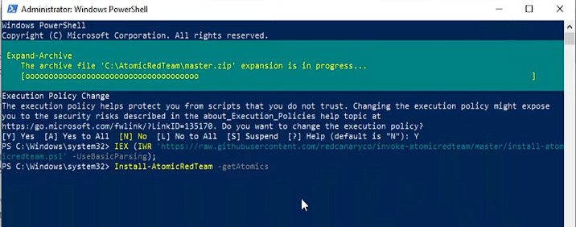{width="5.135416666666667in"
height="1.7344870953630795in"}

**Attack and Log Investigation:**

On the kali machine edited the rockyou.txt file and added my two users
password that I created earlier.

On the client machine enabled the RDP and added the two users there. Its
time to generate the brute force attack on the client pc using crowbar.

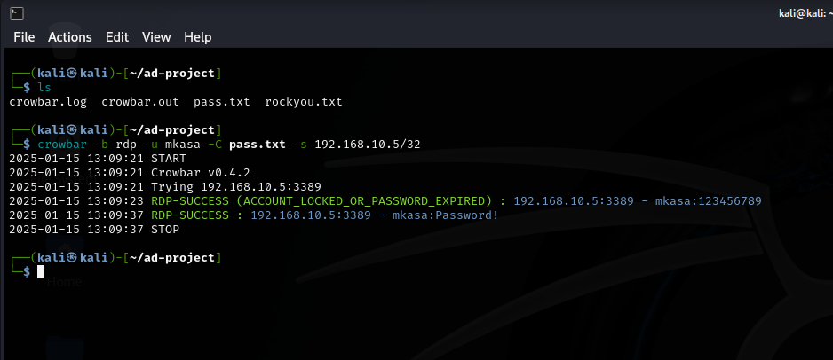{width="6.069690507436571in"
height="2.6292213473315837in"}

Found the brute force attack. Here I had total 50 password in my
rockyou.txt including one correct password on the last line. So 49
failed login attempt happened.

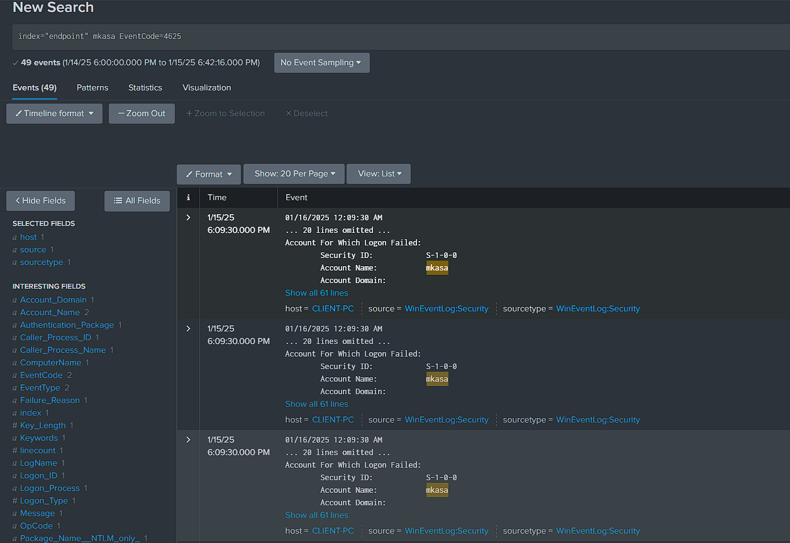{width="6.328125546806649in"
height="4.350586176727909in"}

Found the successful logged one.

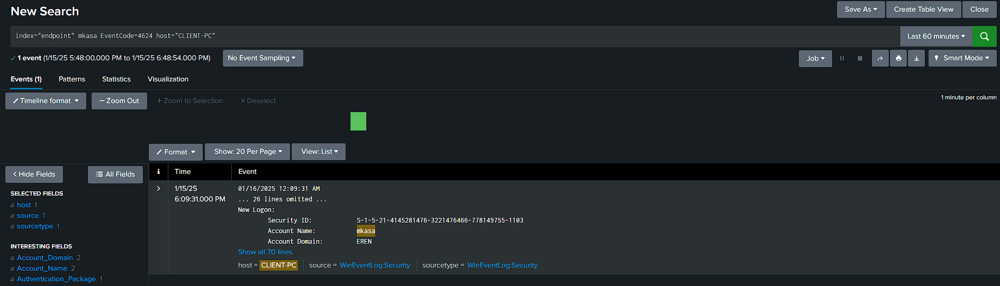{width="6.369792213473316in"
height="2.1875in"}

Here the Source Address and the Workstation Name shows the attacker
machine IP address and name.

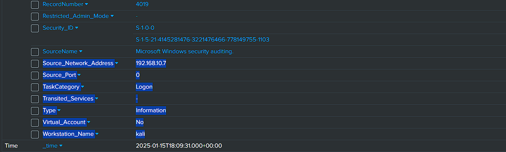{width="6.453125546806649in"
height="2.2023337707786528in"}

**Telemetry Generation and Log Investigation:**

Now generating some telemetry using Atomic Red Team,

{width="7.447916666666667in"
height="4.001389982502187in"}

I have generated telemetry using atomic red team that creates a user.
The username is NewLocalUser. Below is the log that was generated.

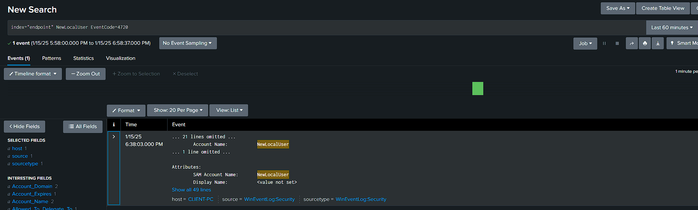{width="6.875in"
height="2.803131014873141in"}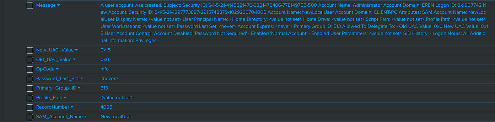{width="6.869792213473316in"
height="2.0104166666666665in"}
